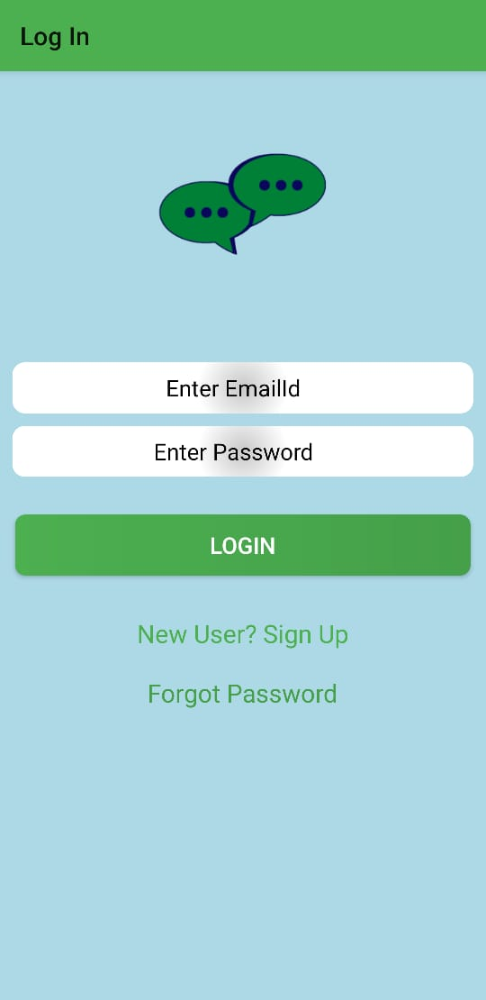
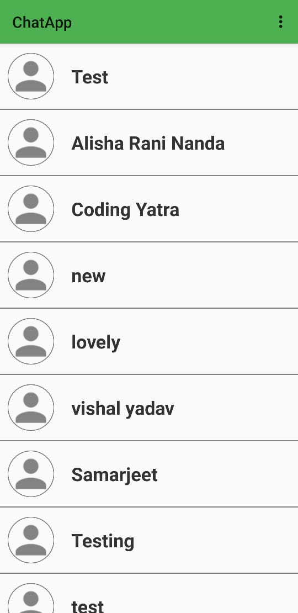
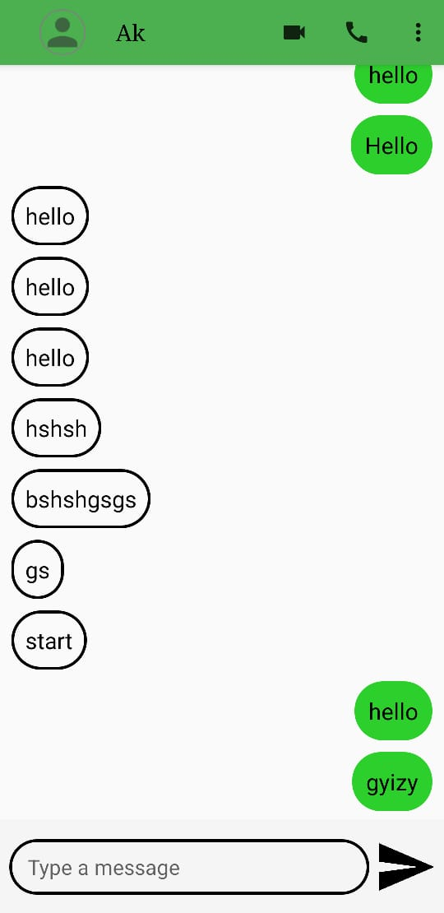
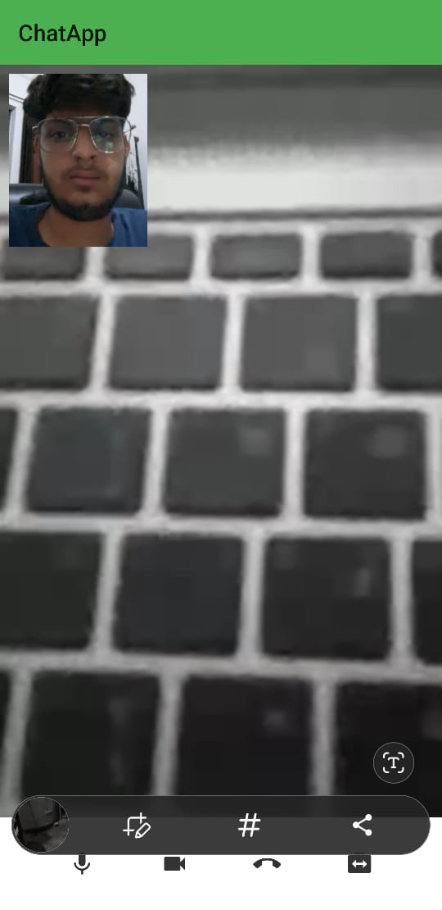

# ChatApp
ChatApp is an android application that allows users to send messages to one another, with the added feature of setting your own profile picture. With this app, you can communicate with your friends, family, and colleagues in a fast and easy way, and also personalize your experience with a profile picture of your choice.

# Features
User registration and login\
Send and receive messages in real-time\
View message history\
Profile picture feature allowing users to set their own display picture

# Getting Started
Create an account or log in if you already have one.\
Start sending messages to App's users and personalize your experience by setting your own display picture.

# Technical details
The app is built using Kotlin and Firebase\
Firebase Realtime Database is used for message storage and retrieval\
Firebase Storage is used for storing user's profile picture

### 1. Login Screen

### 2. Verify Email Screen

### 3. Main Screen

### 4. Chat Screen

### 5. Video Call Screen

